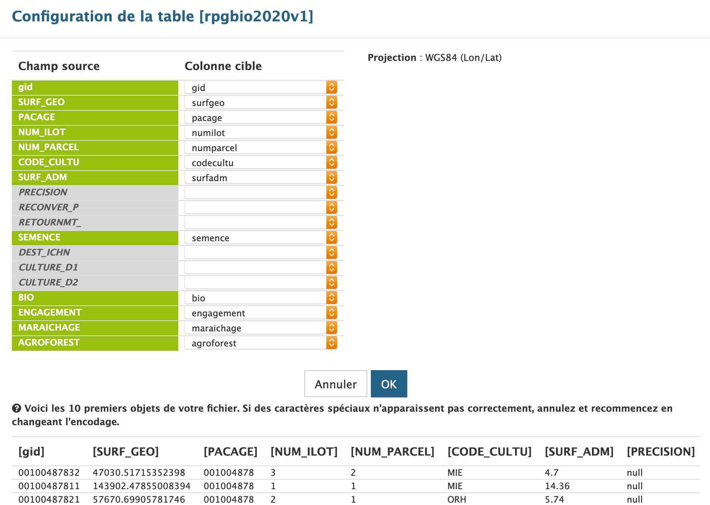

# Espace collaboratif IGN

L'espace collaboratif est accessible sur [espacecollaboratif.ign.fr][espacecollaboratif].
Il nous offre plusieurs services :

- Bases de données Géo
- Serveur de tuiles
- Transactions (enregistrement de modifications)

## Base de données

La base de données "CARTOBIO" contient plusieurs tables,
en général, une par millésime du Registre Parcellaire Graphique (RPG).

### Créer une table vide

- Nom : `rpgbio{year}v{n}`
- Type géométrique : `Polygon` / `2D`

Puis :

1. Le champ `geom` doit être modifié avec un `SRID` à `WGS84` (c'est-à-dire `EPSG:4326`)
1. Créer un nouvel attribut, le nommer `gid` et lui donner un type `String`, `Unique`
1. Créer un nouvel attribut, le nommer `pacage` et lui donner un type	`String`, `Peut servir à la recherche`
1. Créer un nouvel attribut, le nommer `numilot` et lui donner un type	`Integer`
1. Créer un nouvel attribut, le nommer `numparcel` et lui donner un type	`Integer`
1. Créer un nouvel attribut, le nommer `codecultu` et lui donner un type	`String`
1. Créer un nouvel attribut, le nommer `surfadm` et lui donner un type	`Double`
1. Créer un nouvel attribut, le nommer `bio` et lui donner un type	`String`
1. Créer un nouvel attribut, le nommer `engagement` et lui donner un type `String`
1. Créer un nouvel attribut, le nommer `semence` et lui donner un type `Integer`
1. Créer un nouvel attribut, le nommer `maraichage` et lui donner un type `Integer`
1. Créer un nouvel attribut, le nommer `surfgeo` et lui donner un type `Double`
1. Créer un nouvel attribut, le nommer `agroforest` et lui donner un type `Integer`
1. Créer un nouvel attribut, le nommer `numerobio` et lui donner un type	`String`, `Peut servir à la recherche`
1. Changer le nom de l'identifiant, utiliser `gid`
1. Supprimer l'attribut `id`

### Téléverser des fichiers

Il y a plusieurs choses auxquelles veiller :

- la projection doit être en WGS84 (l'app frontend utilise cette projection, et le serveur IGN ne reprojette pas à la volée)
- les noms de fichier des Shapefile ne peuvent pas contenir de tirets (ou autre caractère "exotique")

Les fichiers RPG transmis ne correspondent évidemment pas à ces contraintes.

### Conversion des fichiers RPG

Ils peuvent être convertis à l'aide de l'outil [`ogr2ogr`][ogr2ogr],
fourni par le paquet [`gdal`][gdal].

```shell
RPG_SUFFIX=".zip"
RPG_PREFIX="SURFACES-2019-PARCELLES-GRAPHIQUES-CONSTATEES_"

rm -rf ./cartobio{,.zip}

for FILE in $(ls ${RPG_PREFIX}*.zip); do
  FILE_WITHOUT_SUFFIX=${FILE%${RPG_SUFFIX}};
  DEPT=${FILE_WITHOUT_SUFFIX#${RPG_PREFIX}};
  echo -n "$DEPT ";
  ogr2ogr -overwrite -nln cartobio d${DEPT} "/vsizip/${FILE}";
  ogrinfo "d${DEPT}" -dialect 'SQL' -sql 'CREATE INDEX ON cartobio USING PACAGE';
  ogr2ogr -overwrite -nln cartobio -s_srs EPSG:2154 -t_srs EPSG:4326 d${DEPT} d${DEPT} \
    -dialect 'sqlite' -sql "SELECT (PACAGE || CAST(NUM_ILOT as character(3)) || CAST(NUM_PARCEL as character(3))) AS gid, ST_Area(GEOMETRY) AS SURF_GEO, * FROM cartobio WHERE PACAGE IN (SELECT DISTINCT PACAGE FROM cartobio WHERE BIO=1)";
  ogr2ogr -update -append -nlt POLYGON cartobio d${DEPT} cartobio;
done

zip -9 -r cartobio.zip cartobio
```

Ça prend un certain temps, et ça produit 2 choses :

- 1 répertoire `cartobio` qui contient des fichiers Shapefile ;
- 1 archive `cartobio.zip`.


### Téléverser des fichiers (à nouveau)

Avec ce fichier `cartobio.zip` contenant tout le RPG de l'année,
l'upload devrait bien se passer.

#### Erreur : ogr2ogr failed : ERROR 1: In ExecuteSQL(): sqlite3_prepare(...): near "-": syntax error

C'est que les fichiers dans le ZIP contiennent un caractère exotique,
un trait-d'union en l'occurence (sic).

L'option `-nln` remèdie à ce problème (`-nln cartobio` dans la commande précédente).

#### Erreur : Shape Type not supported: "12800"

C'est parce que la géométrie des Features est de type `MultiPolygon`.

Le type de géométrie doit être forcé à `Polygon` (`-nlt POLYGON` dans la commande précédente).

### Mapping des champs

Une fois le téléversement terminé, une modale d'assignation des champs (du Shapefile) s'affiche.
Elle établit la concordance des fichiers du Shapefile vers la table IGN.



### Attendre

L'intégration du fichier prend quelques minutes.
Les données sont ensuite disponibles pour une utilisation via API ou
l'interface d'administration de l'espace collaboratif IGN.

[gdal]: https://gdal.org/
[ogr2ogr]: https://gdal.org/programs/ogr2ogr.html
[espacecollaboratif]: https://espacecollaboratif.ign.fr
